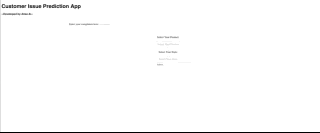

# Customer Issue Prediction APP

An end to end app to predict what issue customers have been faced with by analyzing customer complaints.

## App Overvie

```diff
- The app works like:
```



The customer can type in their complaints and select what product they use and what state are they come from, and then we can predict what issue those customers have been faced with. Based on this prediction, we can assign a customer service manager who are responsible for the corresponding issue for this case. In this way, this app can largely help improve customer satisfaction, and reduce labor force cost for screening customer complaints manually.

## Project Overview

This project used a subset of the **Consumer Complaint Database** from [Consumer Financial Protection Bureau](https://www.consumerfinance.gov/data-research/consumer-complaints/). 

The Customer Issue Prediction Dash App is an end-to-end customer service application that utilizes machine learning and NLP to predict the issue customers have been faced with by analyzing complaints they gave in the industry. This application can help financial institue improve their customer satisfaction and reduce labor cost in customer service.

This repository consists of 5 main components:

[EDA dashboard](https://github.com/Alisaahy/Customer-Issue-Prediction/blob/master/reports/Tableau_dashboard.twb): A Tableau dashboard analyzing all the customer feedback data, including products type, issues type, some geometry information, etc.

[Wordcount visualization](https://github.com/Alisaahy/Customer-Issue-Prediction/blob/master/reports/WordCloud_Visualization.ipynb): Visualized customer complaints text in the dataset using word cloud.

[Target label merge](https://github.com/Alisaahy/Customer-Issue-Prediction/blob/master/Doc2Vec_Merge_Label.ipynb): There're more than 150 types of issues in the dataset. Some of them have nearly the same issue name and some of them contain very similar complaints text. To improve accuracy in the future text classification model, I merged some issues manually, as well as using Doc2Vec model. After this step, I kept 63 final issues for model building.

[Text classification model](https://github.com/Alisaahy/Customer-Issue-Prediction/blob/master/Text_Classification_Prediction.ipynb): This part include text cleaning, sentiment analysis and pipeline development. I trained the machine learning model on data including both text features (customer analysis), and non-text features (product, state and sentiment score) and used it to predict customer issues.

[Dash application](https://github.com/Alisaahy/Customer-Issue-Prediction/blob/master/dash_app.py): Build an end to end app with Dash.


## Methods Used

- Machine Learning
- Natural Language Processing
- Gensim (Doc2Vec)
- Sentiment Analysis (VaderSentiment)
- TF-IDF
- Linear SVC
- etc.

## Technologies

- Dash
- Python
- Pandas
- Scikit-learn
- Gensim
- etc.

## Aplication

You can run the `dash` application locally by downloading the [model pickle file](      ) and using the following command in your terminal:

```
python dash_app.py
```
